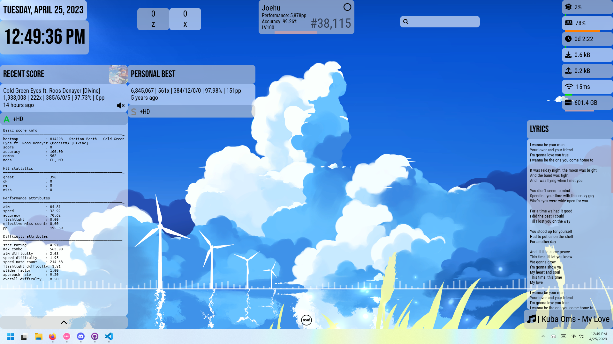
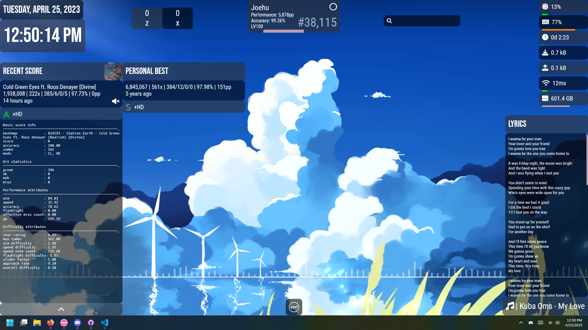

# uhe

A personal Rainmeter suite.

This was made solely for me and not for others in mind, so YMMV.

This project started in July 2019 and has steadily gone through many revisions but is still very WIP. The commit history was reset to not worry and waste time looking if there was something sensitive. It is public now, so I can be more cautious about what to commit.

*Note: This suite contains [osu!](https://osu.ppy.sh)-related skins out of the box.*

Desktop with light mode:

Desktop with dark mode:

*Wallpaper source (Wallpaper Engine): [Blue Sky \[4K\]
](https://steamcommunity.com/sharedfiles/filedetails/?id=2944773634)*\
*Layout: "Uhe osu! Layout"*

## Extensions

There are other skins I've developed in other repositories with the same aesthetic.

- A todo list skin: https://github.com/Joehuu/uhe-todo-list

## Dependencies

Some skins rely on external plugins / software. All Rainmeter plugins listed should be packaged in the `.rmskin`.

- CustomTaskbar
    - TranslucentTaskbar ([Rainmeter Forums](https://forum.rainmeter.net/viewtopic.php?t=24879)) ([DeviantArt](https://www.deviantart.com/arkenthera/art/TranslucentTaskbar-1-2-656402039)) ([GitHub Gist](https://gist.github.com/0x61726b/7a807e04ee8f1d95425f710944667508))
        - Note that Windows 11 22H2 and above broke this.
- osu! scorecards (Best/Recent)
    - Speech ([Rainmeter Forums](https://forum.rainmeter.net/viewtopic.php?f=18&t=31161&p=158239)) ([GitHub Repo](https://github.com/jsmorley/PluginSpeech))
    - [osu-tools (CLI)](https://github.com/ppy/osu-tools)
        - needs to be in Documents/GitHub
- KeyCounter
    - HotKey ([Rainmeter Forums](https://forum.rainmeter.net/viewtopic.php?t=18849)) ([GitHub Repo](https://github.com/brianferguson/HotKey.dll))
- NowPlaying (Web)
    - WebNowPlaying ([Rainmeter Forums](https://forum.rainmeter.net/viewtopic.php?f=127&t=26619)) ([GitHub Repo](https://github.com/keifufu/WebNowPlaying-Redux-Rainmeter))

Licensed under the MIT License.
